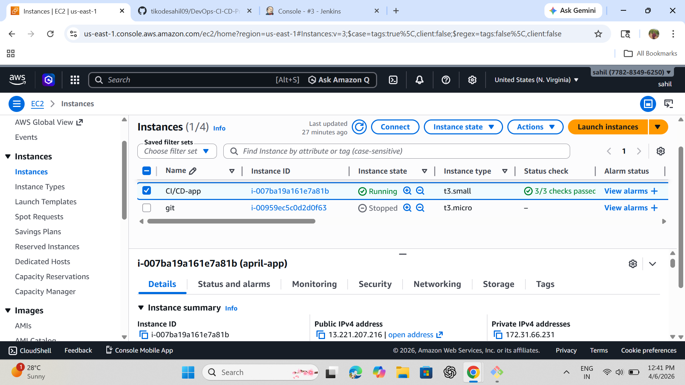

# 🚀 CI/CD Pipeline for deploy WebApplication using Jenkins, Docker, Nginx on AWS EC2

## 📌 Project Overview
This project demonstrates a complete CI/CD pipeline to deploy a Web Application using Jenkins, Docker, and Nginx on AWS EC2.
  Whenever code is updated in GitHub, Jenkins automatically builds and deploys the latest version using Docker containerization.

---

## 🧱 Tech Stack
- GitHub (Source Code)
- Jenkins (CI/CD Automation)
- Docker (Containerization)
- Nginx (Web Server)
- AWS EC2 (Hosting)

---

## 🏗️ Architecture
GitHub → Jenkins → Docker → Nginx → AWS EC2 → Browser

---

## ⚙️ Setup Process

### 1️⃣ Launch EC2 Instance
- Ubuntu Server
- Open Ports: 22, 80, 8080

### 2️⃣ Install Required Tools
- Docker
- Jenkins
- Java (for Jenkins)

### 3️⃣ Configure Jenkins
- Create Pipeline Job
- Connect GitHub Repository

### 4️⃣ Add Dockerfile
- Dockerfile

### 5️⃣ Create Jenkins Pipeline
- Jenkinsfile

🔄 CI/CD Workflow
1. Developer pushes code to GitHub
2. Jenkins pulls the latest code
3. Docker image is built
4. Old container is removed
5. New container is deployed
6. Website goes live on AWS EC2

✨ Key Features
-⚡ Automatic deployment
-🐳 Docker-based setup
-☁️ Hosted on AWS
-🔄 Continuous integration

## 📸 Screenshots

